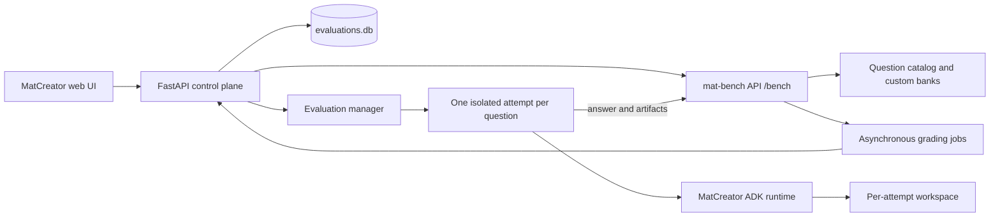

# Evaluation

MatCreator evaluates agent performance against questions served by
[`mat-agent-bench`](https://github.com/AI4MS/mat_agent_bench). The Evaluation
mode in the web application lets you browse the benchmark catalog, create
reusable question sets, generate candidate questions from completed MatCreator
sessions, and run tracked evaluation campaigns.

## Architecture

The evaluation system separates benchmark ownership, agent execution, and
grading. This keeps each question attempt reproducible and prevents one
attempt's workspace or runtime state from leaking into another.



1. The control plane creates a durable evaluation campaign and asks `mat-bench`
   to freeze the selected question IDs into a benchmark session and run.
2. It creates one attempt for each returned question. Every attempt has its own
   workspace, ADK session, runtime home, idempotency key, event log, and
   timeout.
3. The evaluation manager runs queued attempts subject to the campaign's
   parallelism limit and the server-wide
   `MATCREATOR_EVALUATION_MAX_CONCURRENCY` limit (default: `4`).
4. For each attempt, MatCreator downloads declared input files, writes the
   benchmark prompt, runs the agent in benchmark mode, and submits the final
   response plus generated artifacts to `mat-bench`.
5. `mat-bench` grades the submission asynchronously. The control plane polls
   the job, stores the result and attempt events, then marks the campaign
   completed, failed, or cancelled.

In local mode, campaign metadata is stored in
`~/.matcreator/.adk/evaluations.db`, and per-attempt workspaces are below the
selected MatCreator workspace at `evaluations/`. Do not edit these while an
attempt is active.

## Start a Local mat-bench Server

`mat-bench` is installed with MatCreator. For development, run its API and
browser UI from a checkout of `mat_agent_bench` (or any environment where the
`mat-bench` command is available):

```bash
cd /path/to/mat_agent_bench
mat-bench serve --host 127.0.0.1 --port 8080 --allow-token-registration
```

The benchmark UI is available at `http://127.0.0.1:8080` and its API is at
`http://127.0.0.1:8080/bench`. `--allow-token-registration` is deliberately
for local development only: on its first use MatCreator registers and saves a
development token automatically. For a server without that option, configure a
token explicitly.

Configure MatCreator before starting the web application. Environment variables
take precedence over the persistent YAML configuration:

```bash
matcreator config set benchmark.server_url=http://127.0.0.1:8080/bench

# Required when token registration is disabled or when using a shared service.
matcreator config set benchmark.token=your-benchmark-api-token
```

The equivalent `~/.matcreator/config.yaml` section is:

```yaml
benchmark:
  server_url: http://127.0.0.1:8080/bench
  token: your-benchmark-api-token
```

For an ephemeral configuration, export both values before launching MatCreator:

```bash
export MAT_BENCH_SERVER_URL=http://127.0.0.1:8080/bench
export MAT_BENCH_TOKEN=your-benchmark-api-token
bash script/start_matcreator.sh
```

When using automatic registration, omit `MAT_BENCH_TOKEN` and start MatCreator
normally. The token is saved in the local configuration after the first
benchmark request. In all cases, start the MatCreator web UI with:

```bash
bash script/start_matcreator.sh
```

Open `http://localhost:5173`, sign in, and select **Evaluation** in the right
sidebar. A catalog load confirms that MatCreator can reach the benchmark API.

## Generate a Question From a Session

Question generation uses evidence from an existing session, not the model's
unbounded recollection. MatCreator reduces the session log to at most 20 graph
steps, 50 events, and 20 artifact paths, then provides that bounded evidence to
the selected generator and a question-authoring template.

The built-in generators are:

- **MatCreator LLM** (`builtin_llm`): prompts the configured MatCreator LLM to
  return one schema-constrained question object.
- **MKB projection agent** (`mkb_projection`): uses MKB's template-driven
  projection prompt and runner, while keeping the session evidence in
  MatCreator rather than creating an MKB knowledge-frame record.

Both generators must produce one self-contained question that validates against
the authoritative `mat-bench` question schema. They cannot publish directly.
The generated draft remains editable until it is approved, exported, or
published.

To create a draft in the web UI:

1. Complete a session with observable execution activity: graph steps, events,
   or artifacts. A session with none of these cannot yield a grounded question.
2. Open the completed session and use **Generate benchmark question**. Choose
   a generator in the picker; MatCreator stages a YAML draft and validates it
   immediately. The default template is suitable for the current `mat-bench`
   schema; manage custom templates from **Evaluation**.
3. Open the generated draft. Correct invalid YAML, add any declared data files,
   or provide an instruction and use **Refine**. Review the prompt, reference
   answers, scoring checklist, verifier types, and capability labels.
4. Select **Approve** only after validation succeeds. Approval locks in the
   reviewed version for publication; an approved draft can then be published to
   the token-owned custom benchmark bank. Export is also available when a local
   question-bank directory is configured.

Published drafts become read-only. They are published to a bank named from the
signed-in owner, such as `user-alice`; refresh the benchmark catalog afterwards
to select the new question.

## Run an Evaluation

1. In **Evaluation**, filter the benchmark catalog by domain, capability, or
   task type, then select one or more questions. Optionally save the selection
   as a private or shared question set.
2. Set the model label, maximum parallelism, maximum turns, and timeout. The
   model label is reported to `mat-bench`; the currently running MatCreator
   configuration determines the agent runtime itself.
3. Select **Create and start**. The control plane freezes the selection at the
   benchmark server before any agent executes, so later catalog changes do not
   alter the campaign.
4. Follow the campaign list and live attempt feed. Each attempt exposes its
   task prompt, downloaded input filenames, status, result, and event stream.
   You can request cancellation while the campaign is starting or active.

An attempt proceeds through `queued`, runtime startup and execution,
submission, and grading. Terminal outcomes include `completed`, `failed`,
`timed_out`, `cancelled`, and `interrupted`. The campaign is `completed` only
when every attempt completes; otherwise it is `failed` unless it was cancelled.

For troubleshooting, verify these three layers in order:

1. Open `http://127.0.0.1:8080` to confirm the local benchmark service is
   running and inspect its logs for grading failures.
2. Refresh the Evaluation catalog. A missing catalog usually means the
   `benchmark.server_url` is not reachable, lacks the `/bench` suffix, or has
   no usable token.
3. Open the failed attempt in MatCreator. Its stored task payload, runtime
   result, error, and event log distinguish agent/runtime failures from
   benchmark submission or grading failures.

## API Reference

The UI is the recommended entry point. Integrations can use these control-plane
endpoints with the active `user_id` query parameter:

| Purpose | Endpoint |
| --- | --- |
| Browse catalog | `GET /api/evaluations/catalog` |
| Create a campaign | `POST /api/evaluations/campaigns` |
| Start or cancel a campaign | `POST /api/evaluations/campaigns/{campaign_id}/start` or `/cancel` |
| Inspect a campaign | `GET /api/evaluations/campaigns/{campaign_id}` |
| Generate from a session | `POST /api/sessions/{session_id}/evaluation-question-drafts` |
| List, edit, refine, or approve drafts | `/api/evaluation-question-drafts` |
| Publish an approved draft | `POST /api/evaluation-question-drafts/{draft_id}/publish` |

The benchmark URL is a backend-only setting: browser code never receives the
benchmark token.