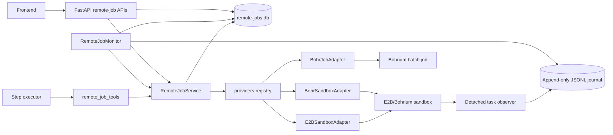

# Remote Job Monitoring

MatCreator manages sandboxes and batch jobs as durable, session-scoped remote
jobs. The remote-job control plane separates a job's provider identity and
liveness from the agent step that created it, so the FastAPI frontend can
observe and control it after an agent, browser, or middleware request
reconnects.

Every provider-specific operation goes through a small adapter protocol (see
[Provider Plugin Architecture](#provider-plugin-architecture) below), so
`RemoteJobService`, `RemoteJobMonitor`, and the web API never branch on a
provider name. Built in providers today: `e2b` (interactive sandbox via the
E2B SDK), `bohr_sandbox` (interactive sandbox via the `bohr` CLI), and
`bohr_job` (batch/HPC-style job via `bohr job submit`).

## Architecture



The SQLite record is the source of truth for MatCreator's normalized job
lifecycle. The provider job/sandbox remains the source of truth for provider
liveness. This distinction lets the UI report both a meaningful lifecycle state
and the latest connectivity observation without conflating them.

## Key Components

| Component | Location | Responsibility |
| --- | --- | --- |
| `RemoteJobStore` | `src/matcreator/control_plane/remote_jobs.py` | Persists jobs, lifecycle transitions, provider snapshots, and user-control events in SQLite. |
| `RemoteJobService` | `src/matcreator/control_plane/remote_job_service.py` | Coordinates provider operations with durable records and enforces valid lifecycle operations, dispatching to the adapter registered for each job's `provider`. |
| `RemoteJobAdapter` protocol | `src/matcreator/control_plane/providers/base.py` | The boundary every provider implements: `create`/`status`/`cancel` are mandatory; `pause`/`resume`/`run_command`/`upload_file`/`download_file`/`collect_outputs` are gated by declared `RemoteJobCapability` flags. |
| Provider registry | `src/matcreator/control_plane/providers/registry.py` | Maps a provider name to a lazily constructed adapter instance. |
| `E2BSandboxAdapter` | `src/matcreator/control_plane/providers/e2b.py` | Interactive sandbox via the E2B SDK: create, commands, files, pause, kill, probe. |
| `BohrSandboxAdapter` | `src/matcreator/control_plane/providers/bohr_sandbox.py` | Interactive sandbox via the `bohr` CLI (`bohr sandbox create/exec/files/describe/delete`). No pause/resume — the CLI has no such subcommand. |
| `BohrJobAdapter` | `src/matcreator/control_plane/providers/bohr_job.py` | Batch/HPC-style job via the `bohr` CLI (`bohr job submit/describe/download/terminate`). Submit-time inputs only; no interactive exec. |
| `RemoteJobMonitor` | `src/matcreator/control_plane/remote_job_monitor.py` | Periodically reconciles active jobs of every registered provider, using each adapter's own `poll_interval_seconds` for backoff scheduling. |
| Sandbox task observer | `src/matcreator/control_plane/remote_task_monitor.py` | Starts one idempotent detached observer per interactive job, records monotonic public heartbeat/stage/process/progress/exit events remotely, and replays them to the local store after reconnect. It does not finalize or validate scientific work. |
| Remote task contract | `src/matcreator/control_plane/remote_task_contract.py` | Builds the deterministic public `mc.remote-task.v1` envelope, explicit workload profile and phase plan, input hashes, and canonical digest. |
| Agent tools | `src/matcreator/agents/execution_agent/remote_job_tools.py` | Provider-specific submit tools (`submit_bohr_sandbox`, `submit_bohr_job`; `submit_e2b_sandbox` is retained for existing e2b jobs but is no longer registered on the step executor) plus provider-generic post-submission tools that dispatch on `job_id` alone. |
| Middleware APIs | `web/main.py` | List jobs/events and offer session-owner pause, terminate, and refresh endpoints, generic across providers. |

## Submission and Persistence

Submission is provider-specific — an interactive sandbox needs a template
while a batch job needs a machine type and image — so there is one submit
tool per provider: `submit_bohr_sandbox`, `submit_bohr_job` (`submit_e2b_sandbox`
is retained for existing e2b jobs but is no longer exposed to the step
executor). Each builds a deterministic idempotency key from the
session, execution node, and a provider-specific discriminator, then
delegates to `RemoteJobService.submit_job(provider=..., spec=...)`.

The service creates the SQLite job record before making the provider request.
`persisted_specification` is an explicit public allowlist. Provider environment
values, API keys, raw command text, and other credentials are excluded; the
private `spec` is passed to the adapter's `create` but never returned to the
browser. New Sandbox submissions also persist an `mc.remote-task.v1` envelope
with explicit `md`, `vasp`, `training`, or `generic` presentation metadata.
An explicit friendly `stable_name` also produces a deterministic, opaque
`provider_session_id` scoped by the MC owner/session/node/template/attempt.
That internal ID is sent to Bohrium as `--session-id` and retained for exact
provider-side correlation during recovery, but is deliberately omitted from
the browser-facing projection. MatCreator never guesses an `external_id` from
that correlation value: if creation may have succeeded but the returned ID was
not durably recorded, the job moves to `lost` with a
`manual_recovery_required` audit record and automatic create replay remains
disabled.
Repeated
calls with the same idempotency key return the existing job instead of
creating a second sandbox or job.

`upload_remote_job_input` hashes the local file as a stream and records only
its declared role, canonical remote path, size, SHA-256, and required flag.
Re-uploading the same remote path replaces that manifest entry and recomputes
the canonical contract digest; local paths and input contents are not stored.

Once creation returns, the service stores the provider-side ID in
`external_id` before making any further provider call, then probes the adapter
once for an initial status (letting a batch
provider start in `queued` instead of always assuming `running`), and
transitions the job accordingly. Agent recovery records the job reference
against the execution graph so an interrupted execution can wait for or
accurately report an existing job rather than resubmitting it.

## Lifecycle and Observations

The store protects lifecycle changes with an allowed-transition state machine.
Important normalized states include:

- `created`, `submitting`, `queued`, `running`, `paused`, and `resuming` for
  active work.
- `succeeded` and `collecting` while a batch job's results are being pulled
  via `collect_remote_job_outputs`.
- `collected`, `failed`, `cancelled`, `terminated`, and `lost` as terminal
  outcomes.

Each change increments `state_revision` and writes an event. Lifecycle
transitions use optimistic concurrency checks, so stale pause, terminate, or
provider updates cannot silently overwrite newer state.

Provider probe data is stored in `snapshot`; examples include
`provider_status`, `sandbox_id`, `phase` (for a batch job), `last_command_exit_code`,
and `last_upload`. An observation does not itself alter the normalized
lifecycle state unless the adapter reports a `normalized_status` that differs
from the current one — see [Provider Plugin Architecture](#provider-plugin-architecture).

## Monitoring and Refresh

`RemoteJobMonitor` considers active jobs of every registered provider and
probes jobs in `queued`, `running`, `submitting`, `resuming`, or
`terminate_requested` states, using
each job's own adapter to decide how — and how often — to probe. A batch
provider like `bohr_job` declares a much longer `poll_interval_seconds` (60s)
than an interactive sandbox (15s), so it is polled far less often without any
special-casing in the monitor itself.

For an interactive adapter (`e2b`, `bohr_sandbox`) a successful probe records
a reachable provider snapshot; a failed probe records `provider_status` as
`unreachable` and increases the next probe delay exponentially, bounded by
the configured maximum backoff. For a batch adapter (`bohr_job`) the same
probe can report a `normalized_status` change (e.g. `queued` -> `running` ->
`succeeded`/`failed`/`cancelled`), which the service turns into an actual
lifecycle transition instead of just an observation.

Monitor schedules are intentionally in memory. The job records themselves are
durable, so a restarted monitor begins by reconciling active jobs from SQLite.
Provider observations have a finite 30-second default deadline, configurable
with `MATCREATOR_REMOTE_PROVIDER_QUERY_TIMEOUT_SECONDS`. Due jobs are probed
concurrently; one hung provider call records a non-terminal timeout observation
and backoff without freezing other jobs or launching a duplicate probe. Explicit
user commands retain their separate long-running timeout contract.
The frontend can also explicitly reconcile an owned job through:

```text
POST /api/sessions/{session_id}/remote-jobs/{job_id}/refresh
```

For interactive Sandboxes, submission additionally bootstraps a detached POSIX
observer under paths derived only from the durable `job_id`. A remote `mkdir`
claim makes background command launch replay-safe: a retry returns the existing
PID or exit marker instead of starting the command again. The observer appends
`mc.task-event.v1` records with one `source_instance_id` and monotonic
`source_seq`; the local monitor ingests each `(job_id, source_instance_id,
source_seq)` once. While the Web process or network is unavailable, events keep
accumulating in the Sandbox. Reconciliation resumes after the durable cursor.

The observer records facts only. It never collects outputs, declares scientific
success, or closes a Sandbox. Those responsibilities remain with one explicit
local finalization owner.

Only explicit workload metrics may be determinate. A launcher or parser can use
`publish_remote_job_progress` for values such as MD step / target step; provider
liveness alone stays indeterminate and never becomes a fabricated percentage.

## Command and Upload Concurrency

Sandbox commands and uploads can take long enough for the monitor or a manual
refresh to update the same record. These operations use
`RemoteJobStore.merge_observation`, which atomically merges non-lifecycle
telemetry into the latest snapshot. Therefore a successful command is returned
to the agent even when a monitor probe updates the job while that command runs.

Strict revision checks remain in place for lifecycle transitions and provider
reconciliation, where accepting stale state would be unsafe.

## Executor Timeout and Remote-Job Handoff

A step executor is a bounded LLM session; a remote job is durable. The two have
independent lifetimes, so a step executor is never kept alive merely to babysit
a running job.

When `SUB_STEP_TIMEOUT` (default 3600s) elapses, the runner checks the durable
job store for a job still owned by that node:

- **No active job** — the step times out as before and returns
  `needs_replanning`.
- **An active job** — the executor is granted a single bounded grace window
  (`STEP_REMOTE_JOB_GRACE_TIMEOUT`, default 300s) to let a nearly finished step
  complete. If it is still unfinished afterwards, the executor is released and
  the step returns `waiting` rather than `needs_replanning`. This is a handoff,
  not a failure: dependents are not blocked, and the job keeps running with no
  executor attached.

The runner writes `status: waiting` and the job identity onto the execution
graph node itself, so the handoff does not depend on the orchestrator LLM
calling `set_node_status`. `reconcile_recovery_state` then keeps the node
`waiting` while the job is still in progress and moves it back to `pending`
once the job settles, so a fresh executor can collect its results. The identical
path also covers a crashed or restarted executor, so there is one recovery
mechanism rather than two.

Re-attachment is explicit rather than accidental. When a node that already owns
a job runs again, the runner injects the job's identity into the executor's
`prior_context` with instructions to call `get_remote_job_status` and never
call any of the `submit_*` tools for that step. In Flash mode, which has no
execution graph, a step's node ID is derived from its label or a hash of its
action, so a repeated step keeps the same submission idempotency key and
re-attaches instead of creating a duplicate job.

## Controls and Ownership

The middleware exposes owner-scoped controls:

```text
POST /api/sessions/{session_id}/remote-jobs/{job_id}/pause
POST /api/sessions/{session_id}/remote-jobs/{job_id}/terminate
```

Both invoke the provider operation through `RemoteJobService`, update the
durable job lifecycle, and append a `user_control` event. They do not cancel
the step-executor process. The executor sees this event through
`get_remote_job_status` and must report `needs_replanning` rather than
retrying an interrupted command or submitting a replacement job. `pause`
returns a 409 (via `CapabilityError`) for a provider that does not support
pausing, such as `bohr_job`.

`terminate_remote_job` irreversibly releases a job or sandbox. Agents should
collect or record required output before calling it.

## Storage Scope

In local mode, agent tools use `ADK_DIR / "remote-jobs.db"`. In server mode,
the middleware routes each owner to a per-user `.adk/remote-jobs.db` under the
user's mounted MatCreator home. This keeps job records, controls, and monitoring
isolated by owner and session.

## Provider Plugin Architecture

Adding a new remote-job provider (a different HPC scheduler, another
sandbox platform, ...) means implementing `RemoteJobAdapter` and registering
it — nothing else in the control plane changes.

1. **Implement the adapter** (`src/matcreator/control_plane/providers/<name>.py`):
   subclass `RemoteJobAdapter` from `providers/base.py` and implement the
   three mandatory methods (`create`, `status`, `cancel`). Declare
   `provider`, `capabilities` (a `frozenset[RemoteJobCapability]`), and
   `poll_interval_seconds` as class attributes. Implement only the optional
   methods your capabilities declare:

   | Capability | Optional method(s) | Example provider |
   | --- | --- | --- |
   | `PAUSE` / `RESUME` | `pause` / `resume` | `e2b` (pause only) |
   | `INTERACTIVE_EXEC` | `run_command` | `e2b`, `bohr_sandbox` |
   | `FILE_TRANSFER` | `upload_file` / `download_file` | `e2b`, `bohr_sandbox` |
   | `BATCH_COLLECT` | `collect_outputs` | `bohr_job` |

   `status` returns a `RemoteJobStatus(normalized_status, snapshot, error)`.
   Use `normalized_status=None` when the provider can only confirm liveness
   (an interactive sandbox that stays "running" until explicitly stopped);
   return one of the canonical statuses from `remote_jobs.py` (e.g.
   `"succeeded"`, `"failed"`, `"cancelled"`) when the provider can report an
   actual lifecycle observation (a batch job that finishes on its own).

2. **Register it** in `src/matcreator/control_plane/providers/__init__.py`
   with a lazy factory:
   ```python
   register_adapter("my_provider", lambda: MyProviderAdapter())
   ```
   The factory is not called until the first `get_adapter("my_provider")`, so
   registering a provider never forces an optional SDK/CLI import at process
   startup.

3. **(Optional) add a submit tool** in
   `src/matcreator/agents/execution_agent/remote_job_tools.py` if the agent
   should be able to submit this provider's jobs — submission parameters are
   inherently provider-specific (a template vs. a machine type + image), so
   this is the one place a new provider needs new code beyond the adapter
   itself. Every operation *after* submission
   (`get_remote_job_status`/`pause_remote_job`/`terminate_remote_job`/
   `run_remote_job_command`/`upload_remote_job_input`/
   `download_remote_job_output`/`collect_remote_job_outputs`) already works
   for any provider without changes, dispatching on the stored `job_id` alone.

`RemoteJobService` and `RemoteJobMonitor` never import a specific adapter or
branch on a provider name — they resolve the adapter for a job through the
registry (`RemoteJobService.adapter_for`) and check `adapter.capabilities`
before calling an optional method, raising `CapabilityError` with a clear,
provider-attributed message if unsupported (e.g. pausing a `bohr_job`).

## Operational Notes

- Built-in providers: `e2b` (interactive, via the E2B SDK), `bohr_sandbox`
  (interactive, via the `bohr` CLI), and `bohr_job` (batch/HPC-style, via the
  `bohr` CLI). The persistent store and service are provider-neutral by
  design; see [Provider Plugin Architecture](#provider-plugin-architecture)
  to add another.
- Commands do not persist command text or output in the remote-job database;
  only limited operational telemetry is recorded.
- A sandbox's configured creation timeout is distinct from the monitoring
  interval. The E2B adapter currently passes `timeout=0` to command
  execution, leaving command duration unrestricted by this control plane.
- `bohr_job` only supports single-job submission (`bohr job submit`); `bohr
  job_group` fan-out (many jobs sharing one group) is a possible future
  adapter, not implemented here.
