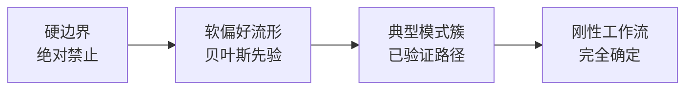
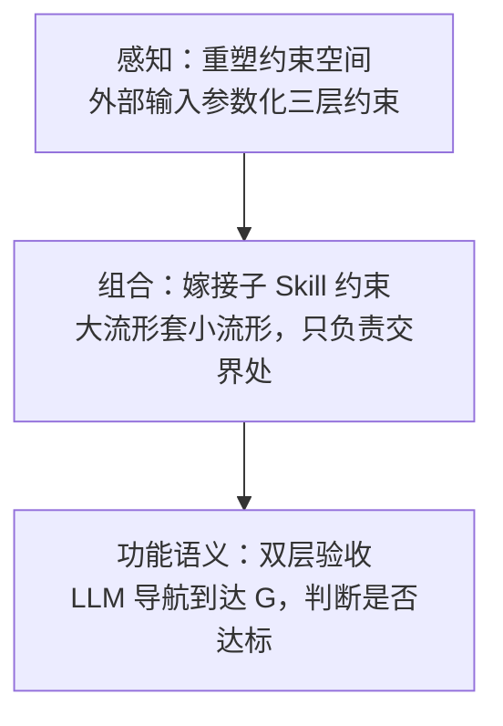
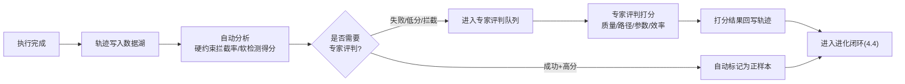
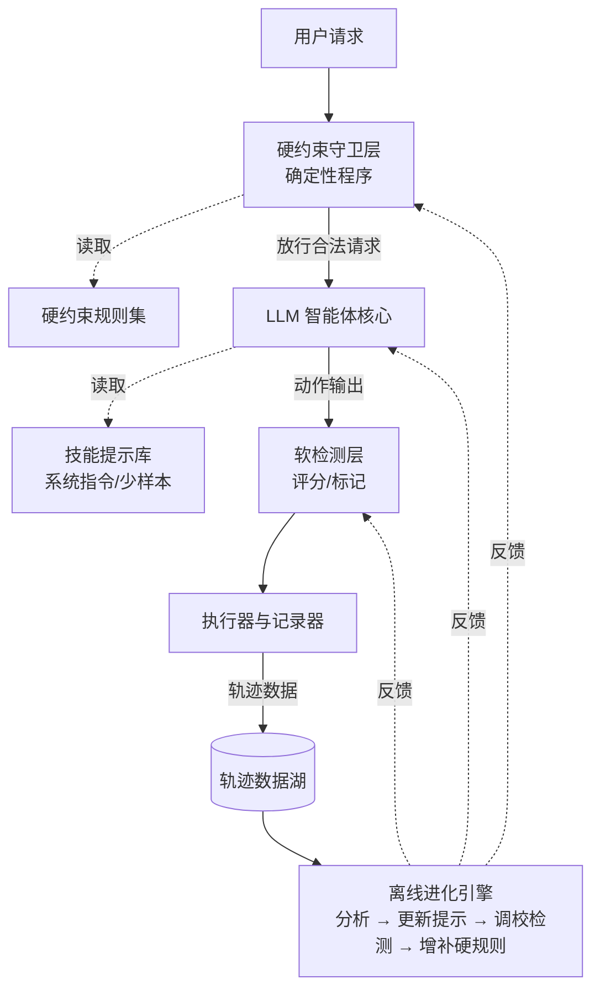

# 从状态空间到自我进化的技能引擎：LLM 智能体技能的本质、框架与实践

> **版本：v0.5** | 最后更新：2026-07-05 | 变更记录见文末附录 D

## 摘要

**背景。** 大语言模型（LLM）作为智能体执行者，正在重塑科研自动化的范式。在材料计算领域，一个核心问题是：如何将领域专家数十年的经验系统性地编码为可执行、可验证、可进化的智能体技能，而非依赖一次性的人工操作。

**问题。** 技能的本质是什么？当执行者从传统控制器变为 LLM 时，约束的保障方式需要如何改变？如何构建一个既能保证安全底线、又能从经验中自我精进的技能系统？

**方法。** 本报告提出一种统一的技能观：技能是在高维状态-动作空间 \(\mathcal{S} \times \mathcal{A}\) 中，从初始状态 \(s_0\) 到目标子集 \(\mathcal{G}\) 的结构化约束流形 \(\mathcal{M}\)。该流形由三层约束共同限定——硬约束（不可逾越的可行边界）、软约束（贝叶斯先验塑造的建议流形）和典型模式簇（已验证的成功路径）。当执行者变为 LLM，连续空间位移为语义令牌域，约束的「硬度」从二值过渡为概率，这迫使我们做出根本性架构决策：硬约束必须由编排层代码绝对保障，软约束与典型路径由提示词柔性注入，而每一次执行轨迹都沉淀为数据，驱动离线进化闭环。

**贡献。** 本报告将上述理论落地为一套「三层守护、持续进化」的完整方法论，并给出从冷启动到飞轮运转的实施路径。该框架旨在实现既安全可靠、又灵活泛化的智能体技能体系，其质量上限不再受限于任何个人专家的知识边界。

---

## 如何阅读本文

本报告共 6 章 + 4 个附录，不同读者可按需选读：

| 读者角色 | 推荐阅读路径 | 关注重点 |
|---------|------------|--------|
| **决策者 / 管理层** | 第 0 章 → 第 6 章结论 → 附录 A | 战略定位与现状差距 |
| **领域专家（材料计算）** | 第 5 章实施路径 → 第 2 章约束谱系 → 第 4 章三层守护 | 如何手搓并进化 Skill |
| **系统工程师** | 第 4 章三层守护 → 附录 A 对照表 → 第 5.4 节配套基础设施 | 工程实现与架构 |
| **理论研究者** | 第 1–3 章全文 → 附录 C 参考文献 | 形式化框架与开放问题 |

## 目录

- **第 0 章** 战略定位：为什么 Skill 而非 Agent 框架
- **第 1 章** 引言：技能作为状态空间中的约束流形
- **第 2 章** 技能的结构：从硬边界到固定工作流的约束谱系
  - 2.1 硬约束 · 2.2 软约束 · 2.3 典型可探索流形 · 2.4 固定工作流
  - 2.5 约束谱系总览
  - 2.6 感知-行动闭环（外部输入对约束空间的参数化重塑）
  - 2.7 组合语法（约束流形的嫁接与层级化封装）
  - 2.8 功能语义（过程正确性与科学质量的双层验收）
- **第 3 章** LLM 作为执行者：空间的位移与约束的解耦
- **第 4 章** 方法体系：构建三层守护、持续进化的技能引擎
  - 4.1–4.3 三层守护 · 4.4 进化闭环 · 4.5 整体架构
  - 4.6 约束与实现手段对应 · 4.7 风险与对策 · 4.8 进化效果度量
- **第 5 章** 实施路径：从手搓到自进化
- **第 6 章** 结论
- **附录 A** 与 MatCreator 当前架构的对照
- **附录 B** 术语对照
- **附录 C** 参考文献与延伸阅读
- **附录 D** 变更记录

---

## 0. 战略定位：为什么 Skill 而非 Agent 框架

在讨论技能系统的理论之前，必须首先明确本报告的战略前提。以下定位已作为团队共识在内部讨论中确认：

1. **智能体框架不是我们的战场。** 大厂（Google ADK、OpenAI、Anthropic 等）在通用 Agent 框架上的投入和能力远超任何领域团队，我们不应、也无需在此与他们竞争。他们会持续提供更强大的编排、推理、工具调用和记忆管理能力。

2. **专家领域 Skill 的打磨是科学智能体落地的关键。** LLM 本身是通用模型，大厂不会、也没有能力为每个垂直科学领域深度打磨 Skills。这需要领域专家将数十年的经验——哪些参数组合有效、哪些路径是死路、哪些中间产物需要如何校验——系统性地编码为可执行的约束和知识。而这正是我们的核心优势所在。

3. **MatCreator 是 Skill 的快速迭代平台。** 它不是面向最终用户的"材料计算服务"，而是我们内部用于快速定义、测试、执行和优化 Skill 的开发环境。它的价值在于缩短"灵感 → 编码为 Skill → 执行验证 → 反馈优化"的循环周期。

4. **项目的终极目标不再是执行材料计算，而是通过执行材料计算来迭代优化 Skill 和数据。** 每一次 DFT 计算、每一次 MD 模拟，其首要产出不是那个计算结果本身，而是那条执行轨迹——它成为 Skill 的"训练数据"，驱动硬约束的增补、软约束的校准、典型流形的积累。计算结果只是副产品，Skill 的进化才是主产品。

5. **微调力场 Skill 是当前唯一完整可参考的标杆。** 由吴宏宇开发的微调力场（pfd-finetuning）Skill 是目前唯一经过充分验证的完整 Skill——从用户输入材料体系到自动生成训练数据、执行 DFT 标记、训练力场、评估质量的全流程闭环已经跑通，可对任意体系快速给出高精度微调力场。后续所有 Skill 的打磨都以它为参照模板。

6. **Skill 打磨计划已正式启动。** 团队每位成员认领特定 Skill 进行深度打磨，本报告即为该计划的方法论基础，为打磨工作提供统一的概念框架和操作规范。

换言之，MatCreator 是一个**以计算为手段、以 Skill 为产品的自我进化系统**。本报告提出的三层约束模型和进化闭环，正是为这一目标服务的方法论基础。

---

## 1. 引言：技能作为状态空间中的约束流形

设想一个智能体面对的环境，其所有可能的情境构成一个高维状态空间 \(\mathcal{S}\)，其所能采取的动作张成动作空间 \(\mathcal{A}\)。在任何有意义的问题中，智能体的行动并非毫无指向，而是被赋予一个目的——从某个初始状态 \(s_0 \in \mathcal{S}\) 出发，抵达一个被定义为"成功"的目标状态子集 \(\mathcal{G} \subset \mathcal{S}\)。

在这个视角下，**技能的本质，就是在 \(\mathcal{S} \times \mathcal{A}\) 的广袤空间中，构建出一条（或一族）能够从 \(s_0\) 稳健地迁移至 \(\mathcal{G}\) 的结构化约束流形。** 它并非空间中的单一路径，而是由多层约束共同作用而形成的一个有边界的、高概率的"通道"，允许泛化但不失控。

!!! note "关于本文的形式化表述"
    本文使用的数学符号（如 \(\mathcal{M}\)、\(\mathcal{G}\)、\(p(\tau \mid \text{style})\) 等）作为**启发式概念锚点**，而非严格的数学定义。约束流形的几何语言旨在为工程决策提供统一的概念框架，帮助理解约束的层级结构与交互方式，不要求读者具备微分几何背景。后续章节中涉及嫁接算子 \(\mathcal{M}_{A \circ B}\) 等更复杂的形式化，同样遵循此原则。

形式化地，设硬约束函数集 \(\{g_i\}\) 与软约束偏好密度 \(p(\tau \mid \text{style})\) 共同限定了约束流形 \(\mathcal{M} \subset \mathcal{S} \times \mathcal{A}\)，技能的目标即是在 \(\mathcal{M}\) 中寻找从 \(s_0\) 到 \(\mathcal{G}\) 的高概率轨迹 \(\tau = (s_0, a_0, s_1, a_1, \ldots, s_T)\)。后续章节将逐步展开 \(\mathcal{M}\) 的内部结构——从硬边界到软偏好，从典型簇到刚性工作流。

本报告将从这一原点出发，逐步展开技能的几何-概率结构，揭示硬边界、软先验与典型模式如何层层收束出可执行的行为。进而，我们将分析当智能体的"大脑"变为大语言模型（LLM）时，这一空间如何被重塑，以及我们应当如何系统性地设计、实施和进化这样的技能系统。

---

## 2. 技能的结构：从硬边界到固定工作流的约束谱系

在状态-动作空间内，仅给出 \(s_0\) 和 \(\mathcal{G}\)，原则上存在无穷多种可能的连接方式。技能的价值在于，它用约束将这种无限可能性压缩为有意义的、可靠的行为模式。这些约束按其强度和本质，构成了一个递进的谱系。

### 2.1 硬约束：不可逾越的可行边界

硬约束划定了技能存在所必须尊重的绝对禁区，形式化为不等式 \(g(s, a) \le 0\)。这些边界将可执行空间切割出一个合法子集，技能流形的任何部分都不得超出。典型实例如 DFT 计算中 K 点密度必须为正、力场训练前训练数据必须包含能量和力标签、分子动力学模拟中时间步长不能超过原子振动周期的 1/10。这些约束由物理定律和算法的数学结构所决定，任何违反都会导致计算崩溃或结果无意义。形式化地，硬约束将可行空间限定为 \(\mathcal{M}_{\text{hard}} = \{(s, a) \in \mathcal{S} \times \mathcal{A} \mid g_i(s, a) \le 0,\; \forall i\}\)，技能流形 \(\mathcal{M} \subseteq \mathcal{M}_{\text{hard}}\) 必须始终位于此集合之内。

硬约束的强度等同于物理定律，是技能安全与可行性的基石。它们的保障不能依赖任何概率性过程——这一点将在后文的方法论部分至关重要。

### 2.2 软约束：贝叶斯先验塑造的建议流形

在合法空间内部，技能还需回答："应当怎样走向目标？"软约束不构成绝对禁止，而是以代价或偏好的形式塑造概率密度。从贝叶斯视角，这等价于在状态-动作空间上放置一个先验分布 \(p(\tau \mid \text{style})\)，它描述了智能体在无具体任务要求时"自然地"应如何行为——例如结构弛豫中力收敛阈值默认为 0.01 eV/Å、MD 模拟温度默认 300K、训练轮数默认 100 个 epoch。这些值并非物理上不可逾越，而是统计上最可能有效的工作区域。

技能学习中的 KL 散度正则化、模仿学习中的示范分布匹配，皆为对这一先验的近似。其效果是在空间中侵蚀出一条条高概率的"河谷"，即建议流形。形式化地，软约束在硬可行集 \(\mathcal{M}_{\text{hard}}\) 上诱导出一个轨迹概率密度 \(p(\tau \mid \text{style})\)，使靠近典型参数的路径获得更高的概率质量。软约束赋予行为以柔性和泛化余地，但不可用于保障安全底线。

### 2.3 典型可探索流形：结构化模式簇

在软约束的概率谷地之内，尚可提炼出更精细的结构：从经验中学习到的典型可探索流形簇。例如，力场训练的 pfd-finetuning 技能可能包含"磷酸盐体系路径"、"氧化物体系路径"、"二维材料路径"等几种根本不同的流程模式，它们在隐空间中形成离散的簇，簇内参数连续可变——磷酸盐路径倾向于 NVT 系综 + 较大 curate 帧数，氧化物路径则偏好 NPT+NVT 组合 + 额外的 DFT+U 修正。每个簇是一个已验证的"成功配方"，整个簇构成该技能的经验知识库。

这些流形簇构成一种中等强度的约束——它将探索限制在特定的动作类别之内，继承整个模式的结构特征，而避免在浩瀚空间中盲目游荡。少样本示例、指令微调、技能嵌入均可塑造此类约束。

### 2.4 固定工作流：极限退化的确定性路径

当约束强度被推到极致，软约束的方差趋于零，流形退化为一条或极少数条完全确定的轨迹，例如 Materials Project 的标准高通量筛选管线——从结构获取到 DFT 静态计算，每一步的参数和输出格式完全固定，不容任何偏离。这是最极端的约束形态，以完全牺牲泛化能力为代价，换取绝对的确定性与可复现性。

### 2.5 约束谱系总览

由此，我们得到一个贯穿的约束谱系：



这一谱系从"只定义什么绝对不能做"到"完全指定每一步做什么"，构成了技能"行为几何"的全部维度。但它仍然只是技能内涵的骨架。一个完整的技能还需要回答三个更深层的问题，它们分别对应技能系统的三个核心能力：

- **感知**（→ 2.6）：外部输入如何对约束空间进行参数化重塑？
- **组合**（→ 2.7）：跨 Skill 的约束流形如何嫁接与层级化封装？
- **功能语义**（→ 2.8）：如何判断执行结果是否在科学意义上真正达标？

三者的协同关系如下：



由此，Skill 的完整定义可以表述为：**一个被外部输入参数化重塑的、由父子 Skill 层级嫁接而成的、带双层验收标准的约束流形。**

### 2.6 感知-行动闭环：外部输入对约束空间的参数化重塑

感知不是一个独立的传感器模块，也不是"看到什么然后做出反应"的简单回路。在约束流形框架下，**感知的本质是外部输入对整个约束空间进行参数化重塑**。

以材料计算为例，用户输入"弛豫 LiFePO₄，我有 CIF 文件，没有标记数据"这一句话，同时改变了三层约束：

```text
用户输入: "弛豫 LiFePO₄，有 CIF，无标记数据"
  │
  ├─ 硬约束重塑: "有结构 + 无标记数据" → train 节点的前置条件不满足
  │               → train 节点被禁用，DFT 标记节点必须包含在 DAG 中
  │
  ├─ 软约束重塑: "LiFePO₄ 含 Fe（过渡金属）" → fmax 从 0.01 收紧到 0.005
  │              "磷酸盐体系" → 推荐使用 PBE 泛函而非 PBE+U
  │
  └─ 典型流形重塑: "磷酸盐体系" → 匹配到 3 条历史成功路径
                   → 推荐 NVT 系综、curate 30 帧、train 100 epoch
```

同一个 Skill，在不同输入下，三层约束的形态完全不同。LLM 不是"感知到什么然后响应"，而是**在被重新参数化后的约束空间里导航**——感知的产物不是一段描述，而是约束空间本身的新形态。

### 2.7 组合语法：约束流形的嫁接与层级化封装

跨 Skill 的组合不是简单的节点串联，而是一个**嫁接问题**——需要在三个层面解决兼容性：

- **格式嫁接**（最浅层）：mattergen 输出 CIF 文件，mattersim 期望 extxyz 格式 → 需要插入转换节点，但谁负责？
- **语义嫁接**（中层）：mattergen 输出标记为"已弛豫的结构"，mattersim 期望"待弛豫的输入结构" → 语义状态需要重置或重新标记
- **约束嫁接**（深层）：两个独立 Skill 的约束流形拼接后，各自的硬/软约束会互相作用，产生新的、在单个 Skill 层面不存在的边界条件。形式化地，设 Skill A 的约束流形为 \(\mathcal{M}_A \subset \mathcal{S}_A \times \mathcal{A}_A\)，Skill B 的为 \(\mathcal{M}_B \subset \mathcal{S}_B \times \mathcal{A}_B\)，两者的嫁接并非简单的 \(\mathcal{M}_A \cap \mathcal{M}_B\)（它们甚至不在同一空间），而是通过接口变量 \(\mathbf{z}\)（如输出文件格式、结构状态标记）进行约束传播：\(\mathcal{M}_{A \circ B} = \{(\mathbf{s}, \mathbf{a}) \mid \exists \mathbf{z}:\; (\mathbf{s}_A, \mathbf{a}_A, \mathbf{z}) \in \mathcal{M}_A \;\wedge\; (\mathbf{z}, \mathbf{s}_B, \mathbf{a}_B) \in \mathcal{M}_B \;\wedge\; \mathbf{z} \in \mathcal{I}\}\)，其中 \(\mathcal{I}\) 为接口兼容性约束集。嫁接的难点正在于 \(\mathcal{I}\) 的确定——它既不在 A 中也不在 B 中，而是在嫁接处新生出的约束。

这催生了一个核心设计原则：**大流形套小流形，且大流形只负责嫁接处。**

```
Skill C: pfd-finetuning（嫁接层）
  sub_skills: [mattergen, mattersim, deepmd]    ← 声明可用子 Skill
  grafting:                                      ← 只定义嫁接规则
    - mattergen → mattersim: CIF 自动转 extxyz，输出状态标记为"待弛豫"
    - mattersim → deepmd: 弛豫结果格式化为 deepmd 训练输入
    - deepmd 输出不达标 → 回 mattersim 的 MD 节点（循环）
  constraints:                                   ← 只定义跨 Skill 约束
    - hard: "mattergen 输出不含磁性信息时，mattersim 不得假设磁性配置"
    - soft: "磷酸盐体系: mattergen 800K + mattersim fmax 0.005 + deepmd 100 epoch"
  quality:                                       ← 只定义最终验收
    - 力场 RMSE < 5 meV/atom
```

C 不介入 mattergen 内部如何生成结构、deepmd 内部如何调学习率——那是子 Skill 自己的事。C 只管交界处。这样设计的好处是：子 Skill 可以独立进化（mattergen 升级不影响 C）、嫁接逻辑可复用（"mattergen → mattersim"的转换规则可被多个父 Skill 引用）、LLM 的导航空间保持开放而非退化为固定工作流。

循环在这里也得到统一处理——它只是决策地图上的一条回路，"eval 不合格 → 回 MD 节点"在 LLM 看来和"eval 合格 → 结束"没有本质区别，都是决策点的一个分支。

### 2.8 功能语义：过程正确性与科学质量的双层验收

功能语义拆解为两个不可合并的层次：

**第一层：过程正确性（硬约束 + 软检测）**

流程跑通了，没有触犯规则，每步产出了该产出的东西。例如，pfd-finetuning 的所有节点依次执行完毕，硬约束全部通过，软检测得分在可接受范围内。但这只能说明"过程没出错"，不能说明"结果有用"。

**第二层：科学质量达标性（领域专家定义的验收指标）**

结果本身在科学意义上是否合格。这些指标必须显式定义在 Skill 的约束中，作为 \(\mathcal{G}\) 的具体化：

- 力场训练：RMSE_energy < 5 meV/atom，RMSE_force < 0.1 eV/Å
- 结构弛豫：所有原子受力 < 0.01 eV/Å，晶格常数与实验值偏差 < 2%
- MD 模拟：扩散系数在合理数量级范围内，轨迹无异常跳跃

没有这些指标，\(\mathcal{G}\) 只是一个空洞的抽象概念，执行引擎不知道"跑到哪里算成功"。这些指标不是执行后的人工事后检查，而是 Skill 定义的一部分——它们决定了进化闭环中的"成功"标签如何生成，从而驱动后续的约束优化和流形扩展。

---

## 3. LLM 作为执行者：空间的位移与约束的解耦

当技能的执行者从传统控制器变为大语言模型（LLM）时，前述所有概念都会经历一次深层的转换。

### 3.1 可执行空间的语义化

状态与动作不再由连续数值坐标表示，而是离散的自然语言令牌序列。技能"弛豫 LiFePO₄ 结构"表现为一组在语义上等价但措辞不同的文本指令集——可以是"用 VASP 对 LiFePO₄ 做结构优化"，也可以是"对磷酸铁锂初始结构进行 DFT 弛豫"。因此，流形不再属于几何空间，而属于语义空间；典型流形簇变成了语义同义簇、推理路径簇（如弛豫前先判断磁性配置、弛豫后检查晶格常数是否偏离超过 5% 等思维链分支）。形式化地，状态空间从连续坐标 \(\mathcal{S} \subset \mathbb{R}^n\) 位移为离散令牌序列空间 \(\mathcal{S}_{\text{tok}} \subset \Sigma^*\)，约束流形 \(\mathcal{M}\) 相应地变为语义空间中的子集。这一位移的根本后果是：连续空间中的距离度量被语义相似度取代，约束的“硬度”——即违反约束的概率——从二值的 \(\{0, 1\}\) 漂移为连续的 \(p \in [0, 1]\)。

### 3.2 软约束的极大丰富与硬约束的隐患

LLM 携带巨量的预训练先验，这恰好为前述"软约束即贝叶斯先验"（形式化为 \(p(\tau \mid \text{style})\)）的观点提供了最强有力的实例：**常识、社会规范、文风偏好均被内化，无需手动编码。** 系统提示词和少样本示例则可直接向先验上叠加新的偏好或定义典型流形。

然而，正如 3.1 所述，硬约束 \(g_i(s, a) \le 0\) 经语言表达后，将不可避免地从二值判定漂移为概率性期望。一句"训练前必须确保数据已正确标记能量和力"在足够长的对话、足够混乱的指令面前，可能被忽略、误导或幻觉突破。LLM 可能直接跳过数据验证步骤而发起训练，导致数小时的 GPU 时间浪费在无效输入上。**因此，在 LLM 智能体系统中，硬约束无法由提示词负责，必须由外部确定性手段保障。**

### 3.3 功能语义与组合语法的内化

LLM 的一个深远优势是，它将行为的"形状"与行为的"意义"天然耦合。同一个"运行 MD 模拟"节点，LLM 能够根据上下文理解其目的——如果前序节点是弛豫，MD 是为了探索构型空间；如果前序节点是力场训练，MD 是为了验证模型预测能力。同时，层次化的任务分解、顺序执行与条件分支等组合语法，可由模型作为语言序列直接规划和生成——例如自动判断"用户已提供 DFT 标记数据，可直接跳过标记步骤进入训练"，从而根本性地解决了前述缺失的维度。

### 3.4 技能进化的新可能

由于 LLM 能够从文字示例中即时学习，我们获得了用数据动态重塑技能流形的能力。每次任务执行的完整轨迹，都含有如何改进的珍贵信息。**这意味着，技能系统可以不再依赖一次性的手工设计，而变为一个持续从经验中自我完善的闭环。**

---

## 4. 方法体系：构建三层守护、持续进化的技能引擎

基于上述理论，我们提出一套 LLM 智能体技能系统的完整实现方法论。其核心原则是：**约束类型必须与其实现手段的可靠性相匹配。**

### 4.1 第一层守护：编排程序的绝对硬边界

所有硬约束必须实现在 LLM 之外的编排层，作为不可绕过的安全核心。形式化地，编排层将硬约束 \(g_i(s, a) \le 0\) 实现为确定性判定函数 \(\text{validate}: \mathcal{S}_{\text{tok}} \times \mathcal{A}_{\text{tok}} \to \{\text{pass}, \text{block}\}\)，对 LLM 提议的每一个动作进行即时校验。

#### 结构化输出校验

要求 LLM 输出结构化动作（如 JSON），编排层用规则引擎和模式匹配阻断违规动作。例如，当 LLM 提议的 DAG 中 train 节点之前没有 dft 或 label 节点时，编排层直接拒绝执行并返回错误，因为训练数据必须包含能量和力标签。

#### 状态机守卫

用确定性的状态机定义合法行为流程。编排层仅允许 LLM 提议符合当前状态的下一动作。

#### 环境沙箱与权限

执行层仅有最小权限，危险系统调用在操作系统层面被禁绝，LLM 完全无法触及。

#### 断言式前置条件检查

对于任何执行器命令，必须通过逻辑断言才可发出。例如，提交 VASP 计算前必须验证 INCAR 中 K 点网格密度 > 0、输入结构包含完整的原子坐标和元素类型字段。

如此，硬约束成为与 LLM 推理过程完全解耦的代码防火墙，提供数学级保证。

### 4.2 第二层守护：提示词注入的软约束与典型路径

在这一层，我们充分利用 LLM 的能力塑造行为。

#### 软约束注入

系统提示词中写入领域指南和偏好描述（"优先使用 MatterSim 进行快速弛豫，仅在精度不足时启用 DFT"、"含过渡金属的体系请在弛豫前确认磁性配置"）。这些文本直接塑造了语义空间的概率流形。

#### 典型路径定义

用详细的规程描述或少量高质量示范，直接划定一个任务的标准操作流形簇。例如，pfd-finetuning 技能注入历史成功路径："磷酸盐体系 3 次成功，路径为 build → MD(NVT, 500 步) → curate(30 帧) → DFT(PBE) → train(100 epoch) → 评估收敛"，模型在此基础上根据当前体系（如换成氧化物）做泛化调整。

#### 柔性检测与自评

在动作执行前或执行后，可用以下机制进行软校验：

| 机制 | 说明 |
|------|------|
| **LLM 自评** | 要求模型按给定标准对自身行为打分 |
| **独立评分器** | 使用更轻量的专用模型对输出进行合规/风格打分 |
| **规则软标记** | 用正则或简单 NLP 检测不当内容，仅给出警告而不阻断任务 |

软检测的分数不用于阻断（除非分数极低且业务允许改为请求人工），而是作为后文进化循环的关键信号。

### 4.3 第三层守护：执行与反馈的数据沉淀

每一次智能体任务的完整"会话"都必须被全面记录，形成一条执行轨迹数据，包括：

- 用户请求与环境初始状态
- 模型每一步的推理与动作提议
- 硬约束检查结果（通过/拦截）
- 软检测得分和标注
- 最终结果（成功/失败/人工修正）

**关键原则：错误数据与成功数据同等重要。** 一条触发硬约束被拦截的轨迹，其价值不亚于一条成功执行到底的轨迹。前者告诉我们"在什么输入条件下 LLM 容易违规"，后者告诉我们"什么路径是可靠的"。两者缺一不可，共同构成技能进化的完整原材料。

特别值得记录的错误模式包括：

| 错误类型 | 分析价值 |
|---------|---------|
| 硬约束拦截 | 什么输入条件下 LLM 多次尝试越过同一边界？→ 该边界是否需要更前置的提示或更严格的守卫 |
| 软检测低分但执行 | 什么情况下 LLM 的行为在"合规"边缘？→ 软约束的提示词是否需要更精确的表达 |
| 执行失败（非约束） | 参数组合、体系类型、路径拓扑与失败之间是否存在统计相关性？→ 是否应升级为新的硬约束或软约束 |
| 人工修正后成功 | LLM 最初的规划哪里出了问题？用户是如何修正的？→ 该修正动作是否应固化为自动决策点 |

这些轨迹数据进入"技能数据湖"，成为技能进化的唯一原材料。

#### 4.3.1 轨迹记录的 schema

每一次执行轨迹必须结构化存储，以下是轨迹记录的最小 schema：

| 字段 | 类型 | 说明 | 示例 |
|------|------|------|------|
| `trajectory_id` | string | 全局唯一标识 | `traj_2026_07_05_001` |
| `session_id` | string | 会话标识 | `sess_a3f8` |
| `skill_name` | string | 使用的 Skill 名称 | `pfd-finetuning` |
| `skill_version` | string | Skill 版本号 | `v0.4.2` |
| `user_request` | string | 用户原始输入 | "弛豫 LiFePO₄，有 CIF，无标记数据" |
| `material_system` | string | 材料体系标签 | `phosphate/LiFePO4` |
| `dag_plan` | json | LLM 规划的 DAG | `{"nodes": [...], "edges": [...]}` |
| `dag_executed` | json | 实际执行的 DAG（含人工修正） | `{"nodes": [...], "edges": [...]}` |
| `step_logs` | array | 每步执行记录 | `[{step, action, params, output, duration}]` |
| `hard_constraint_results` | array | 硬约束检查结果 | `[{rule, status, detail}]` |
| `soft_detection_scores` | array | 软检测得分 | `[{metric, score, note}]` |
| `expert_review` | object | 专家评判（见 5.4.4） | `{quality, path, params, comment}` |
| `final_status` | enum | 成功 / 失败 / 人工修正 | `success` / `failure` / `human_corrected` |
| `quality_metrics` | object | 科学质量指标 | `{RMSE_energy, RMSE_force}` |
| `reproducibility` | object | 可复现性信息 | `{seed, software_version, input_hash}` |
| `timestamp` | datetime | 执行时间 | `2026-07-05T10:30:00Z` |

在 MatCreator 中，轨迹数据通过 Know-Do Graph 的 memory 节点持久化（对应 `agents/session_log.py` 和 `agents/thinking_agent/trajectory.py`），并可通过 `knowledge/query.py` 按材料体系、Skill 名称、执行状态等维度检索。这使得"给定一个新材料体系，检索历史上类似体系的成功/失败路径"成为可能——这正是典型流形注入 Planning prompt 的数据来源。

#### 4.3.2 轨迹评判工作流

轨迹写入数据湖后，并非每条都需要专家介入。系统先做自动分类，再决定是否路由到专家评判队列：



自动分类的规则：成功且软检测高分的轨迹自动标记为正样本，无需人工介入；失败、低分、硬约束拦截、首次执行的新材料体系、探索预算产生的轨迹则进入专家评判队列。专家评判的具体维度与交互流程见 5.4.4 节。

### 4.4 进化闭环：用数据反向优化提示词与检测器

这是整个方法论的核心引擎——也是 Skill 系统区别于传统工作流的关键所在。**如果说硬约束保障了安全底线，软约束提供了行为指引，那么进化闭环赋予了 Skill 自我精进的能力。** 每一次材料计算执行，其首要价值不在于那个计算结果，而在于它成为 Skill 的一笔"训练数据"。

进化闭环并非只从成功中学习——**失败和边缘案例往往比成功包含更多信息量。** 当数据积累到一定规模后，启动离线的技能精炼循环。形式化地，进化闭环可表述为对技能参数 \(\theta\)（包括提示词文本、软约束参数值、典型路径库）的优化问题：\(\theta^* = \arg\max_\theta \;\mathbb{E}_{\tau \sim \mathcal{D}_\theta}\left[\mathbf{1}_{\tau \in \mathcal{G}} \cdot q(\tau) - \lambda \cdot r(\tau)\right]\)，其中 \(\mathcal{D}_\theta\) 为当前技能参数下的轨迹分布，\(\mathbf{1}_{\tau \in \mathcal{G}}\) 为成功指示函数，\(q(\tau)\) 为科学质量评分，\(r(\tau)\) 为资源消耗（GPU 时间等），\(\lambda\) 为效率惩罚系数。该优化无解析解，需通过离线数据驱动的方式近似求解：

1. **筛选与分类**：从数据湖中按轨迹类型分类——
   - 正样本：高成功率 + 高软检测得分的轨迹
   - 边缘样本：低软检测得分但仍执行完成的轨迹
   - 硬约束拦截样本：触发硬约束被阻断的轨迹
   - 失败样本：执行失败（计算崩溃、收敛失败等）的轨迹

2. **失败模式分析**：
   - 统计硬约束拦截的频率分布：**哪些硬约束被触发最多？在什么输入条件下触发？** 例如，"含过渡金属的体系触发'train 前无 labeled 数据'拦截 12 次，其中 8 次是用户提供了数据但 LLM 未识别为已标记"——这提示我们需要改进 LLM 对数据状态的判断能力，而非收紧硬约束本身。
   - 统计软检测低分的模式：**什么体系类型、什么参数组合下打分持续偏低？** 例如，"氧化物体系在 NPT 步数 < 500 时软检测得分均值仅 0.3"——这提示该条件下软约束需要更强的提示词强调。
   - 统计执行失败的共同特征：**失败是否集中在特定材料体系、特定计算引擎、特定参数区间？** 例如，"含 Cr 的体系在 PBE 泛函下收敛失败率 80%"——这可能触发将"含 Cr 体系禁用 PBE"升级为硬约束。

3. **优化提示词**：利用自动提示工程从正样本中提炼出最精简、最泛化的指令和典型路径描述。具体而言，轨迹数据为结构化的 DAG + 参数 + 结果三元组，并非自然语言对话，因此需先将其序列化为提示词示例（如「体系: LiFePO₄ → DAG: build→MD(NVT)→curate→DFT→train → 结果: RMSE 3.2 meV/atom ✓」），再以成功率为优化信号，通过 DSPy 的 BootstrapFewShot 或文本梯度方法迭代调整示例的选择与措辞。失败轨迹同样序列化为负面示例（如「体系: Cr₂O₃ → DAG: ...→DFT(PBE) → 结果: SCF 不收敛 ✗」），注入提示词的注意事项区段。同时从边缘样本和拦截样本中提取"应避免的表述"和"需强调的注意事项"，更新至技能提示库。

4. **调校软检测器**：分析低分轨迹和失败轨迹中的共性模式，调整系统指令中的强调点，或为软检测器添加新的规则/示例，使其对高风险场景的评分更准确。

5. **增补硬约束规则集**：如果硬约束拦截样本或失败样本暴露出先前未料到的危险模式，就在编排层新增一条确定性校验规则。**但这里的关键不是简单加规则——而是先分析拦截模式，判断问题是出在 LLM 的理解不足（应优化提示词）还是约束本身确实缺失（应加规则）。** 例如，"含 Cr 体系 PBE 发散"被拦截 20 次，但其中 15 次 LLM 在拦截后自行调整为 PBE+U 并成功——这说明不需要新规则，只需要在提示词中提前告知 LLM 这个陷阱。

这一闭环意味着，**技能从静态设计品，演变为一个被成功经验蒸馏、被失败案例硬化的活系统。**

### 4.5 整体架构



### 4.6 三层约束与实现手段的对应关系

| 约束层级 | 强度 | 实现手段 | 校验方式 | 进化方式 |
|---------|------|---------|---------|---------|
| 硬约束 | 绝对 | 编排层代码（状态机 + 断言 + 沙箱） | 确定性拦截 | 人工审核后增补规则 |
| 软约束 | 概率 | 系统提示词 + 少样本示例 | LLM 自评 + 独立评分器 | 自动提示工程优化 |
| 典型流形 | 参考 | 历史路径注入 + 规程描述 | 相似度匹配 | 聚类 + 蒸馏 |

### 4.7 进化闭环的自身风险与对策

进化闭环赋予 Skill 自我精进的能力，但自我进化的系统本身也存在失效模式，必须在设计阶段预为防范：

| 风险 | 机制 | 对策 |
|------|------|------|
| **反馈放大** | 软检测器自身有偏差时，进化闭环会沿偏差方向强化——低分区域被持续标记为「应避免」，高分区域被持续强化，偏差被放大 | 定期用人工标注的黄金标准集校准软检测器；引入探索预算（见后文 5.4.5）强制覆盖被低分标记的区域 |
| **评分套利** | LLM 可能学会产出「合规但无科学价值」的输出——形式上满足软检测的高分模式，但实际质量低（类比 reward hacking） | 科学质量验收指标（第二层）必须独立于软检测器，由确定性程序计算（如 RMSE、收敛判据），不参与提示词优化 |
| **历史偏见** | 典型流形聚类依赖历史数据，对未被覆盖的新材料体系（如高熵合金、复杂界面）存在系统性忽视 | 探索预算对新体系自动提高；典型流形检索时对「无匹配」结果显式标记并触发探索而非回退到最近邻 |
| **局部收敛** | 进化闭环可能在某类体系上收敛到局部最优——磷酸盐体系持续优化但无法泛化到硅酸盐 | 跨体系迁移测试：每次进化后，在新体系上做影子运行，检验泛化能力是否随优化而下降 |
| **版本回退震荡** | 新版本在某些场景更好、某些更差，反复回退导致系统在版本间震荡 | A/B 对比需积累足够样本后再决策（见后文 5.4.1）；引入「最小观测期」机制，新版本上线后至少运行 N 次才能评估 |

### 4.8 进化效果度量

进化闭环跑起来后，必须回答一个元问题：**Skill 系统是否真的在变好？** 没有度量，进化闭环本身就是一个无法验证的黑盒。以下指标构成进化效果的最小度量集：

| 指标 | 定义 | 目标趋势 | 采集方式 |
|------|------|---------|---------|
| **成功率提升率** | 同一体系类型在进化前后的首次执行成功率差值 | 单调上升 | 按版本快照统计 |
| **约束增补频率** | 单位时间内新增硬约束规则的数量 | 递减（收敛） | 审核日志 |
| **拦截率衰减** | 硬约束被触发的频率随时间的变化 | 递减 | 执行轨迹统计 |
| **跨体系迁移率** | 进化后的 Skill 在未参与训练的新体系上的成功率 | 不低于原值 | 影子运行测试 |
| **人工修正率** | 执行后需要人工修正才能成功的比例 | 递减 | 轨迹标注 |
| **探索成功率** | 探索预算执行中产生有效新路径的比例 | 稳定在 10–30% | 探索日志 |

特别需要关注的是**成功率的局部 vs 全局**之分：如果某次进化后磷酸盐体系成功率 +15% 但氧化物体系 -10%，全局均值可能持平甚至下降——这正是 4.7 节“局部收敛”风险的量化信号。因此，成功率必须按体系类型分桶统计，不可仅看全局均值。

!!! tip "度量节奏建议"
    以周为单位生成进化效果报告，以月为单位做跨版本对比。新版本上线后至少运行 N=30 次同类任务才能评估（参考 5.4.1 A/B 对比机制），低于此样本量的结论不具统计意义。

---

## 5. 实施路径：从手搓到自进化

前述方法论描绘了一个完整的自进化系统，但我们不能跳过冷启动阶段——在没有任何执行轨迹之前，系统无法自动生成或优化 Skill。第一批 Skill 必须由领域专家手工编写，这不是缺陷，而是任何数据驱动系统的必经之路：先用人工标注启动飞轮，再用飞轮产生的数据替代人工。本章讨论手搓 Skill 的局限性、对 know-how 积累的加速作用，以及从零开始的具体路径。

!!! info "与 Skill 打磨计划的对接"
    团队已正式启动 Skill 打磨计划——每位成员认领一个 Skill 进行深度打磨。微调力场（pfd-finetuning）Skill 已由吴宏宇率先完成，验证了从用户输入到力场生成的全流程闭环，作为所有后续打磨工作的参照模板。本章的五步路径即为打磨计划的操作指南：选种子 → 最简形式 → 影子运行攒数据 → 启动进化闭环 → 模板复用。

### 5.1 手搓 Skill 的局限性

随着 Skill 数量增长，手搓模式会遭遇多重瓶颈，这些瓶颈恰好定义了进化闭环需要解决的核心问题：

| 瓶颈 | 表现 | 进化闭环如何解决 |
|------|------|-----------------|
| **覆盖面** | 一个专家深耕 2-3 个体系，但材料空间有上百万种组合。手搓 Skill 永远只能覆盖"已知已知"——专家知道自己知道的。大量"未知未知"（你根本不知道这个体系会在这里出问题，直到跑崩了一次）无法被手搓捕获 | 执行轨迹积累 → 失败模式分析 → 自动发现新的约束边界 |
| **一致性** | A 专家写"含过渡金属时 fmax 要小"，B 专家写"fmax ≤ 0.01 for d-block elements"。LLM 面对不一致的约束描述时推理质量下降。手搓模式天然缺乏统一的约束表达规范 | 自动提示工程 → 从成功轨迹中蒸馏统一的约束语言 |
| **负面约束缺失** | 人天然倾向于记住成功经验，遗忘失败教训。手搓 Skill 往往写满了"应该怎么做"，缺少"什么情况下不要这样做" | 失败模式分析 → 从拦截日志和失败轨迹中自动提取负面约束 |
| **时效性** | VASP 6.4 → 6.5 换了默认赝势，MatterSim v1 → v2 改了模型架构。手搓 Skill 更新完全依赖专家记得去改，滞后于软件生态 | 新版本 Skill 影子运行 → 自动对比新旧版本成功率 → 提示专家审核 |
| **可转移性** | 为磷酸盐体系打磨的软约束，无法自动迁移到硅酸盐体系——即使约束逻辑相似，也需要专家重新手写 | 典型流形聚类 → 相似体系约束自动继承 + 专家确认 |

核心矛盾：**手搓 Skill 的质量上限是专家的个人知识边界，而材料科学的探索空间远超任何个人知识边界。** 进化闭环的终极意义，就是突破这个边界。

### 5.2 手搓 Skill 对 know-how 积累的加速作用

尽管有上述局限，即使是最原始的手搓 Skill，其对 know-how 积累的加速效果也远超传统方式：

**从隐性到显性**

传统模式下，一个博士后离职，他关于"磷酸盐 DFT 哪些参数容易踩坑"的知识就消失了。手搓 Skill 将这种隐性知识编码为可执行、可验证、可进化的显式约束。每一个 Skill 是一份"活的知识资产"，不随人员流动而消失。

**从单次到复用**

传统模式下，每次遇到新体系，专家都要从头思考参数策略。手搓一个 Skill 后，专家写一次"含过渡金属时 fmax 收紧到 0.005"，此后所有含过渡金属的弛豫任务都自动受益，无需专家再次介入。一次投入，无限复用。

**从个人经验到集体数据**

传统模式下，专家的经验只存在于自己脑中。Skill 执行后产生轨迹数据——10 个用户各跑 10 次 pfd-finetuning，100 条轨迹汇聚成统计结论："磷酸盐体系 fmax 0.005 的成功率是 0.01 的 2 倍"。这个结论不是任何一个人能得出的，只有 Skill 系统能跑出来。

**从慢反馈到快反馈**

传统模式下，专家调整参数 → 提交计算 → 等结果 → 分析 → 再调，一个循环数天到数周。Skill 的进化闭环将反馈周期压缩到分钟级：LLM 规划 → 硬约束校验 → 执行 → 软检测 → 数据沉淀。know-how 的迭代速度提升 2-3 个数量级。

**从孤立到交叉**

传统模式下，VASP 专家和 deepmd 专家各干各的。Skill 的嫁接层天然要求跨领域知识整合——"mattergen 生成的结构在什么条件下适合直接进 mattersim 弛豫"这个问题的答案，需要结构生成和力场计算两个领域的专家知识同时在场。Skill 系统迫使这种交叉发生，产出的 know-how 价值远超单一领域。

### 5.3 如何开始：手搓阶段的五步路径

**第一步：选种子 Skill（2-3 个）**

选择标准：高价值（经常被使用的工作流，如 pfd-finetuning、批量弛豫）、高确定性（专家对流程和约束有清晰认知，不需要太多探索）、可验证（有明确的科学质量验收标准）。数量不宜多——初期目标是验证闭环，而非追求覆盖面。**微调力场 Skill 已率先完成打磨并验证了全流程闭环，后续打磨者可直接参考其 SKILL.md 结构、约束定义和验收标准作为起点。**

**第二步：从最简形式启动（v0.1）**

不要一上来就追求完整的 SKILL.md + graph.yaml + 三层约束。从最简形式起步：

```
Skill v0.1:
  - SKILL.md: 一段文字描述流程、关键参数、常见陷阱
  - 硬约束: 最多 3 条，写在代码里（validate_graph 扩展）
  - 软约束: 3-5 条建议，直接写在 Planning prompt 里
  - 典型流形: 空（等数据积累）
  - 验收标准: 1-2 个关键科学指标
```

**第三步：影子运行，攒数据**

将手搓 Skill 与现有工作流并行运行。LLM 规划的 DAG 和人工操作的流程做对比——差异在哪、哪个更优、LLM 在哪一步出错。这个阶段不求全自动，只求攒数据。目标：积累 50-100 条完整的执行轨迹，覆盖成功、失败、硬约束拦截、软检测低分等各种类型。

**第四步：数据够量后，启动第一轮进化闭环**

50-100 条轨迹后，软约束的统计优化开始有意义，典型流形开始成形，失败模式开始呈现规律。这一阈值的依据是：软约束参数（如 fmax 默认值）的优化至少需要覆盖 3-5 种材料体系、每种体系 10-20 条轨迹，才能形成有统计意义的对比；失败模式分析至少需要 10-20 条同类型失败才能呈现规律性，低于此规模时单条失败可能只是噪声。启动 4.4 的进化闭环：筛选分类 → 失败模式分析 → 优化提示词 → 调校软检测器 → 评估是否需要增补硬约束。从这轮开始，手搓的占比开始下降，系统自动优化的占比开始上升。

**第五步：用第一个进化成功的 Skill 作为模板，启动下一个 Skill 的冷启动**

复用后文 5.4.2 所述的冷启动机制——专家用自然语言描述意图，系统用已有 Skill 的约束结构作为骨架自动生成初稿，专家只做确认和修正。第二个 Skill 的手搓成本比第一个低一个数量级，第三个更低。飞轮开始转起来了。

### 5.4 飞轮转起来之后：配套基础设施

当进化闭环开始运转，以下六个机制不再是可选优化，而是系统稳定运行的必需基础设施。它们处理的是"进化闭环跑起来之后才会真正面临的问题"。

#### 5.4.1 Skill 版本管理与 A/B 对比

进化闭环跑起来后，Skill 会不断变化。但"变化了"不等于"变好了"——新版本可能在某些场景更好、某些场景更差。因此必须引入版本控制：

- 每次约束/提示词/典型路径的更新自动生成一个新版本，记录变更内容和触发变更的数据依据
- 新版本先以**影子模式**运行：新 Skill 产出 DAG 但不实际执行，仅与旧版本做差异对比
- 积累足够对比数据后，自动报告："新版在氧化物体系成功率 +15%，但磷酸盐体系 -3%"
- 支持按体系类型选择性启用不同版本——某些体系用 v3，某些体系暂留 v2
- 允许一键回滚，回滚时自动关联触发回滚的失败案例

#### 5.4.2 冷启动：Skill 作者体验

当前 Skill 创建是纯手工写 Markdown，门槛高、反馈慢。而 Skill 质量是系统瓶颈——垃圾进垃圾出。需要降低创作门槛：

- 领域专家用自然语言描述："我想做什么、什么情况下不能做、什么参数大概在什么范围"
- 系统自动生成 SKILL.md 初稿 + 初始约束 YAML + 若干典型路径骨架
- 系统用少量历史案例（如果有）做模拟规划，展示"如果用这个 Skill，我会排出这样的 DAG"
- 专家确认或修正每一层 → 进入**实验性**状态 → 跑够 N 次且成功率达标后自动升级为**已验证**
- 实验性 Skill 在执行时带有明确标记，LLM 被提示"此 Skill 尚未充分验证，请更谨慎地使用其约束"

#### 5.4.3 多 Skill 组合的约束传播

前述讨论集中在单个 Skill 内部的三层约束。但实际任务往往跨 Skill 组合——"先生成结构（mattergen）→ 再弛豫（mattersim）→ 再训练力场（deepmd）"。这带来三个新问题：

- **硬约束传播**：Skill A 的硬约束是否影响 Skill B 的合法空间？例如，mattergen 生成的 CIF 不含磁性信息，则下游 mattersim 不能假设默认磁性配置——编排层需要在跨 Skill 边界处自动插入转换或校验节点
- **典型流形跨 Skill 拼接**："磷酸盐体系：mattergen 的生成温度 800K + mattersim 的弛豫 fmax 0.005 + deepmd 的 100 epoch"是一条完整的跨 Skill 成功路径，应作为一个整体流形存储和检索
- **失败归因跨 Skill 追责**：如果 mattersim 弛豫失败，根本原因可能是 mattergen 生成的结构不合理（如原子间距过近），也可能是 mattersim 自身的参数不当。归因系统需要沿 DAG 边回溯，定位原始责任节点

#### 5.4.4 人工审核闭环的设计

硬约束增补需要人工审核，但如果每次触发都弹窗让专家审批，很快会沦为"已读不回"。需要设计合理的人机交互节奏：

- **聚合而非逐条**："过去一周，'含 Cr 体系 PBE 发散'出现了 20 次，影响 5 个不同 Skill。建议升级为硬约束。点击查看 20 条轨迹详情。"
- **优先级排序**：拦截频率 × 影响严重程度（浪费的 GPU 小时数、产生的错误结果数）→ 最值得关注的候选约束排在最前面
- **一键操作**：接受（直接生成规则代码）、拒绝（标记原因，同类候选 30 天内不再提示）、修改（调整规则条件后接受）
- **审核节奏**：每周一次聚合报告，紧急情况（如安全问题）除外

##### 专家评判打分的维度与流程

上方的审核闭环主要针对硬约束增补。但对于轨迹质量的评判——即"这条执行轨迹的路径规划、参数选择、最终结果是否合理"——需要另一套机制，让领域专家直接参与打分。这是进化闭环中最关键的人机交互环节。

**评判维度**

| 评判维度 | 说明 | 评分范围 | 材料计算示例 |
|---------|------|---------|-------------|
| **路径合理性** | LLM 规划的 DAG 拓扑是否符合专家直觉？是否有多余或缺失的节点？ | 1–5 | "路径 build→MD→curate→DFT→train 合理，但 MD 步数偏少" → 4 |
| **参数选择** | 关键参数（fmax、K 点密度、训练轮数等）在该体系下是否恰当？ | 1–5 | "fmax 0.005 对含 Fe 体系偏严，0.01 足够" → 3 |
| **科学质量** | 最终结果是否在科学意义上合格？（RMSE、收敛性等） | 1–5 | "RMSE 3.2 meV/atom，力场质量优秀" → 5 |
| **效率** | 执行轨迹在保证质量的前提下是否高效？有无明显浪费？ | 1–5 | "DFT 步骤重复弛豫了两次，浪费 GPU" → 3 |

**评判触发时机**

不是每条轨迹都需要专家评判（4.3.2 节已定义了自动分类规则）。以下场景触发专家评判：

- 执行失败（非硬约束拦截）的轨迹：必判
- 软检测得分低于阈值的轨迹：必判
- 首次执行的新材料体系：必判
- 探索预算产生的轨迹：必判
- 随机抽检（每周 5% 的成功轨迹）：抽判
- 成功且高分的常规轨迹：自动标记为正样本，不判

**评判界面设计**

```text
┌────────────────────────────────────────────────────────────┐
│  轨迹评判: traj_2026_07_05_001                               │
│  Skill: pfd-finetuning v0.4.2 | 体系: LiFePO₄ (磷酸盐)      │
├────────────────────────────────────────────────────────────┤
│  用户请求: "弛豫 LiFePO₄，有 CIF，无标记数据"                 │
│  DAG: build → MD(NVT,500步) → curate(30帧) →               │
│       DFT(PBE) → train(100ep) → eval                       │
│  最终状态: success | RMSE_energy: 3.2 meV/atom ✓            │
│                   RMSE_force: 0.08 eV/Å ✓                  │
├────────────────────────────────────────────────────────────┤
│  路径合理性:  [1] [2] [3] [●] [5]  (4/5)                     │
│  参数选择:    [1] [2] [●] [4] [5]  (3/5)                     │
│  科学质量:    [1] [2] [3] [4] [●]  (5/5)                     │
│  效率:        [1] [2] [●] [4] [5]  (3/5)                     │
├────────────────────────────────────────────────────────────┤
│  评语: fmax 0.005 对磷酸盐偏严，建议默认 0.01；              │
│        MD 500 步足够，路径拓扑合理。                         │
│  [提交评判]  [标记为典型路径]  [建议硬约束增补]              │
└────────────────────────────────────────────────────────────┘
```

专家在评判界面中可以看到完整的 DAG 拓扑、每步参数、硬约束检查结果、软检测得分和最终科学质量指标。打分完成后，结果回写到轨迹记录的 `expert_review` 字段，并触发以下反馈路径：

**评判结果如何反馈到进化闭环**

| 评判结果 | 反馈路径 |
|---------|---------|
| 路径合理性低分 | → 提示词优化：更新 Planning prompt 中的路径规划指引 |
| 参数选择低分 | → 软约束调整：更新默认参数推荐值 |
| 科学质量低分 | → 硬约束审查：检查是否需要新增质量验收规则 |
| 效率低分 | → 软约束调整：更新参数推荐值以减少浪费 |
| 专家评语中的修正建议 | → 典型流形更新：将专家修正固化为新的路径示例 |
| "标记为典型路径" | → 典型流形库：将该轨迹加入正面示例池 |
| "建议硬约束增补" | → 硬约束审核队列：进入上方聚合审核流程 |

这一设计确保专家的每一次评判都不会“打完就忘”——评判结果直接驱动提示词、软约束、硬约束和典型流形四个层面的更新，形成从专家判断到 Skill 进化的完整闭环。

#### 5.4.5 探索预算

我们反复强调 LLM 应自由探索、不被规则绑死。但纯自由探索效率低——大部分随机路径是死路。通过"探索预算"机制在效率与创新之间取得平衡：

- 默认 95% 的情况下，LLM 沿典型流形导航（安全、高效、可预期）
- 5% 的情况下，系统主动**鼓励** LLM 探索：在 Planning prompt 中注入"试试不走 curate 步骤，直接 DFT 后训练？"或"这个体系还没有已验证路径，请提出一个合理的探索方案"

> 以上 95/5 分割为初始默认值，待运行数据积累后按各体系类型的探索成功率自动校准——成熟体系可降至 2%，新体系可提高至 20%。
- 探索结果无论成功失败都完整记录：成功则扩展典型流形，失败则标记为"不建议路径"并注入后续 Planning 的负面示例
- 探索预算可以按体系类型动态调整——对成熟体系（磷酸盐）降低预算至 2%，对新体系（高熵合金、复杂界面）提高预算至 20%
- 探索预算本身也是一个可学习的参数：如果某类体系近期探索成功率持续走低，自动降低预算；如果持续走高，自动提高预算

#### 5.4.6 执行轨迹的可复现性

材料计算中，同一个参数跑两次可能结果不同——随机种子不同、集群负载不同、软件版本微小差异。这给进化闭环带来噪声：失败可能是随机的而非 Skill 的问题。需要：

- 记录完整的可复现环境：软件版本（精确到 commit hash）、随机种子、输入文件哈希、集群节点类型
- 同一轨迹被多次复现时，合并统计而非重复计数——避免 10 次复现把一次偶然成功夸大为 10 次独立成功
- 区分**确定性失败**（参数问题，每次复现都失败）和**概率性失败**（随机性导致，有时成功有时失败）：
  - 确定性失败 → 应触发参数约束的优化或硬约束的增补
  - 概率性失败 → 应触发对随机性来源的排查（如 SCF 收敛对初始波函数的敏感性），或在软约束中增加"建议多次运行取平均"的提示
- 为每个典型流形记录其可复现性置信度："该路径在 5 种不同随机种子下复现，成功率 100%" vs "该路径仅执行 1 次，尚未复现"

---

## 6. 结论：从几何直觉到工程系统的贯通

本报告从一个几何直觉出发——技能是在状态-动作空间中从 \(s_0\) 到 \(\mathcal{G}\) 的约束流形 \(\mathcal{M}\)——经多层展开，最终落地为一套可工程化的三层守护体系。回顾全文的逻辑链条：

**从几何到语义。** 约束流形 \(\mathcal{M} \subset \mathcal{S} \times \mathcal{A}\) 首先被分解为硬边界 \(\mathcal{M}_{\text{hard}}\)、软偏好 \(p(\tau \mid \text{style})\) 和典型模式簇三层结构（第 2 章）。当执行者变为 LLM，连续空间位移为语义令牌域 \(\mathcal{S}_{\text{tok}}\)，约束的「硬度」从二值漂移为概率，这迫使我们做出根本性的架构决策：硬约束必须由编排层代码绝对保障，软约束和典型路径由提示词柔性注入（第 3 章）。

**从结构到进化。** 三层守护（第 4 章）不仅是一个静态的安全架构，更是一个动态的数据闭环。每一次执行轨迹——无论成功还是失败——都沉淀为技能数据湖中的训练样本，驱动提示词优化、软检测器调校和硬约束增补。进化闭环将 Skill 从静态设计品变为活系统，使其质量上限不再受限于任何个人专家的知识边界。

**从理论到实践。** 第 5 章给出了从冷启动到飞轮运转的完整路径：手搓种子 Skill（v0.1）→ 影子运行攒数据 → 启动第一轮进化 → 以进化成功的 Skill 为模板加速下一个的冷启动。六个配套基础设施（版本管理、冷启动体验、跨 Skill 约束传播、人工审核闭环、探索预算、可复现性）确保飞轮稳定运转而非失控。

**核心论点重申。** MatCreator 的战略定位不是与大厂竞争通用 Agent 框架，而是以计算为手段、以 Skill 进化为产品。每一次 DFT 计算和 MD 模拟的首要产出不是计算结果本身，而是那条驱动 Skill 进化的执行轨迹。三层约束模型（硬约束代码化、软约束提示词化、典型路径数据化）和进化闭环构成了这一战略的方法论基础。

**局限与展望。** 本报告的理论框架仍有若干待深化之处：约束流形 \(\mathcal{M}\) 的形式化目前停留在隐喻层面，嫁接操作 \(\mathcal{M}_{A \circ B}\) 的接口约束集 \(\mathcal{I}\) 的自动确定机制尚待研究；进化闭环的优化目标 \(\theta^*\) 在高维提示词空间中的收敛性缺乏理论保证；系统自身的失效模式（反馈放大、评分套利、历史偏见、局部收敛）虽已在 4.7 节识别并提出对策，但对策的有效性仍需在真实运行中验证。这些开放问题将随着 MatCreator 的实际部署和轨迹数据的积累，在后续迭代中逐步收敛。

---

## 附录 A：与 MatCreator 当前架构的对照

下表将本报告的理论要素与 MatCreator 的实际代码实现逐项对照，标注成熟度（🟢 已明确 / 🟡 部分实现 / 🔴 待实现）和对应的代码模块，以便工程师定位落地位置。

| 理论要素 | MatCreator 当前状态 | 对应代码模块 | 成熟度 | 差距 / 下一步 |
|---------|-------------------|------------|--------|--------------|
| 硬约束 | 部分。SkillToolset 过滤禁用技能，但无 DAG 级硬约束校验 | `skill.py` (MatCreatorSkillToolset) | 🔴 待实现 | 需新增编排层校验（validate_graph），在 DAG 构建后执行确定性约束检查 |
| 软约束 | 部分。SKILL.md 参数建议通过技能加载注入，但未结构化提取到 Planning prompt | `skill.py`, `agents/thinking_agent/planning.py` | 🟡 部分实现 | 需从 SKILL.md 提取为结构化上下文，在 Planning 阶段注入 LLM 推理 |
| 典型流形 | 部分。执行轨迹通过 trajectory 和 session_log 记录，但未实现相似上下文检索注入 | `agents/thinking_agent/trajectory.py`, `agents/session_log.py` | 🟡 部分实现 | 需新增执行轨迹持久化与相似上下文检索，为 Planning 提供历史参考 |
| 进化闭环 | 部分。知识合成器实现记忆→知识蒸馏，审查管线支持自动审核，但未反馈到 Skill 提示词/硬约束 | `knowledge/synthesizer.py`, `knowledge/review.py`, `knowledge/extractor.py` | 🟡 部分实现 | 需建立"轨迹→约束更新→提示词优化→Skill 迭代"的完整闭环 |
| 验收系统 | 待实现。无前置/中间/最终校验 | — | 🔴 待实现 | 需新增三层校验：前置硬约束拦截、中间软约束提示、最终质量评估与归因 |
| 战略定位 | 已明确。项目以 Skill 为核心，Know-Do Graph 持久化知识 | `skill.py`, `knowledge/` 全模块 | 🟢 已明确 | 需持续强化"以计算为手段、以 Skill 进化为产品"的项目导向 |
| 轨迹记录 | 部分。会话日志记录执行过程，但格式未对齐进化闭环需求 | `agents/session_log.py`, `agents/thinking_agent/trajectory.py` | 🟡 部分实现 | 需扩展轨迹格式，纳入硬约束检查结果、软检测得分、科学质量指标 |
| 人工审核 | 部分。审查管线支持批量审核，但无聚合报告和优先级排序 | `knowledge/review.py` (run_review_pipeline) | 🟡 部分实现 | 需新增聚合报告、优先级排序、一键操作等 5.4.4 节描述的交互功能 |

## 附录 B：术语对照

| 术语 | 定义 |
|------|------|
| \(\mathcal{S}\) | 状态空间（所有可能的情境） |
| \(\mathcal{A}\) | 动作空间（所有可能的动作） |
| \(s_0\) | 初始状态 |
| \(\mathcal{G}\) | 目标状态子集（成功条件） |
| \(\mathcal{M}\) | 约束流形（\(\mathcal{S} \times \mathcal{A}\) 的子集，由硬/软约束共同限定） |
| \(\mathcal{M}_{\text{hard}}\) | 硬可行集（由硬约束 \(g_i(s,a) \le 0\) 切出的合法子集） |
| \(\mathcal{S}_{\text{tok}}\) | 语义令牌空间（LLM 执行者下 \(\mathcal{S}\) 的离散化形态） |
| \(\mathcal{I}\) | 接口兼容性约束集（Skill 嫁接时在交界处新生出的约束） |
| \(\theta\) | 技能参数（提示词文本、软约束参数值、典型路径库的统称） |
| \(\theta^*\) | 进化闭环的最优技能参数 |
| 硬约束 | 不可违反的绝对边界，需确定性程序保障 |
| 软约束 | 概率性偏好，由提示词/先验分布表达 |
| 典型可探索流形 | 已验证的成功路径簇，由历史数据聚类形成 |
| 编排层 | LLM 之外的确定性代码层，负责硬约束校验 |
| 技能数据湖 | 全部执行轨迹的持久化存储 |
| 进化引擎 | 离线分析轨迹数据并反向优化各层的系统 |

---

## 附录 C：参考文献与延伸阅读

本报告的理论框架综合了多个领域的研究成果。以下文献按主题分组，供深入阅读：

**约束流形与运动规划**

- Kavraki, L. E. et al. "Probabilistic roadmaps for path planning in high-dimensional configuration spaces." *IEEE Transactions on Robotics and Automation*, 1996. — 约束流形概念的几何起源。
- LaValle, S. M. *Planning Algorithms*. Cambridge University Press, 2006. — 状态空间规划的综合教材。

**LLM 智能体架构**

- Yao, S. et al. "ReAct: Synergizing Reasoning and Acting in Language Models." *ICLR*, 2023. — LLM 推理-行动闭环的奠基工作，对应本文第 3 章。
- Wang, L. et al. "Plan-and-Solve Prompting: Improving Zero-Shot Chain-of-Thought Reasoning." *ACL*, 2023. — 分层任务规划与 LLM 的结合。

**自动提示工程**

- Khattab, O. et al. "DSPy: Compiling Declarative Language Model Calls into Self-Improving Pipelines." *arXiv:2310.03714*, 2023. — 提示词自动优化框架，对应本文进化闭环第 3 步。
- Zhou, Y. et al. "Large Language Models Are Human-Level Prompt Engineers." *NeurIPS*, 2022. — 自动提示工程（APE）方法。

**材料计算工作流自动化**

- Pizzi, G. et al. "AiiDA 1.0, a scalable computational infrastructure for reproducible high-throughput workflows." *npj Computational Materials*, 2020. — 材料计算工作流管理的同类系统，可对比其确定性工作流与本报告的柔性约束流形。
- Mathew, K. et al. "Atomate: A high-level interface to generate, execute, and analyze materials science workflows." *Computational Materials Science*, 2017. — 高通量材料计算管线，对应本文"刚性工作流"约束形态。

**贝叶斯先验与模仿学习**

- Osa, T. et al. "An Algorithmic Perspective on Imitation Learning." *Foundations and Trends in Robotics*, 2018. — 模仿学习中的示范分布匹配，对应本文软约束即先验的观点。
- Levin, D. A. & Peres, Y. *Markov Chains and Mixing Times*. AMS, 2017. — KL 散度正则化的数学基础。

---

## 附录 D：变更记录

| 版本 | 日期 | 变更内容 |
|------|------|---------|
| v0.1 | 2026-05 | 初版：提出约束流形概念、三层约束谱系、LLM 执行者的空间位移 |
| v0.2 | 2026-06 | 新增第 4 章三层守护方法论、第 5 章实施路径、附录 A 架构对照 |
| v0.3 | 2026-06 | 新增 4.7 进化闭环风险与对策、5.4 配套基础设施六节 |
| v0.4 | 2026-07-05 | 结构化摘要；新增阅读路径与目录；2.5.1–2.5.3 提升为 2.6–2.8 独立章节；ASCII 图转 Mermaid；新增 4.8 进化效果度量；扩展附录 A 增加代码模块与成熟度列；新增附录 C 参考文献与附录 D 变更记录；配置 MkDocs 数学公式渲染 |
| v0.5 | 2026-07-05 | 第 0 章对接团队共识（5→6 点）并标注；新增微调力场 Skill 作为标杆案例；4.3 节新增轨迹 schema 表格与评判工作流 Mermaid 图；5.4.4 节新增专家评判维度、触发时机、界面设计与反馈闭环；第 5 章对接 Skill 打磨计划 |